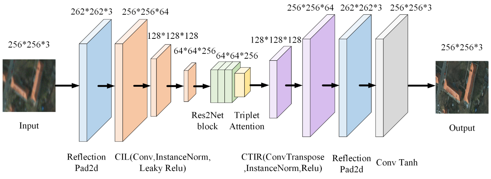

# Radar high-resolution algorithm based on target scene
## 1. Introduction
This project is the 17th batch of college student innovation projects of Northeastern University.  

The responsible person and core members are [Tianshuo Yuan](https://github.com/ProAlize) and [Wenyan Jiang](https://github.com/comradejiang).

## 2. Abstract 
Aiming at the problems of information loss and lack of data sets in some special scenarios in multi-modal image imaging, a high-resolution image imaging method based on an improved residual generator is proposed and incorporated into the produced virtual data set for effect assistance. First, images of different modalities are processed by cropping and filling, and then the images are subjected to Gaussian blur processing. The ResNet module in the [CycleGAN](https://github.com/junyanz/pytorch-CycleGAN-and-pix2pix) residual generator is replaced by the [Res2net](https://github.com/Res2Net/Res2Net-PretrainedModels) module and the [TripletAttention attention](https://github.com/zhouhaoyi/TripletAttention) mechanism module is embedded in the last layer of the encoder. Use the improved CycleGAN as the backbone network to extract and fuse features of images of different modalities. Use the [Vaihingen dataset](https://www.isprs.org/education/benchmarks/UrbanSemLab/default.aspx) to supplement the virtual dataset to train the model using a small sample learning method. Finally, on the [SEN1-2 dataset](https://github.com/YuChuang1205/SEN1-2-patch-dataset), it is compared with the common Algorithms are compared. Experimental results show that the accuracy of the model using the TripletAttention attention mechanism and adding a virtual data set to assist training has been improved, and the model is more robust.

## 3. Image high-resolution imaging method based on improved residual generator
### 3.1 Overall framework
Train the data using small sample learning methods, and obtain the target image after passing through an enhanced Res2net feature extraction module and an embedded TripletAttribute feature enhancement module.  
The following diagram is the 

### 3.2 [Res2Net](https://github.com/Res2Net/Res2Net-PretrainedModels)

Due to the fact that synthetic aperture radar sensors do not provide rich visual image information like optical sensors , 
We chose to use Res2net to replace the original Resnet generator, which can increase the receptive field, better extract global information in local images, and better extract local information in large images.

### 3.3 [TripletAttention attention](https://github.com/zhouhaoyi/TripletAttention)
For input tensors, triple attention utilizes rotation operations and residual transformation to establish interdependencies between dimensions, and encodes inter channel and spatial information with negligible computational overhead. Compared with other attention mechanisms, triple attention improves efficiency with reduced parameter count

### 3.4 Virtual Dataset
In order to compensate for the shortage of datasets, Unity was used to construct a virtual scene dataset. The experimental results showed that the addition of virtual datasets helps to improve the accuracy of the model.  

Shows the left side as the Vaihingen dataset and the right side as the virtual dataset

### 3.5 Partial Framework Diagram

